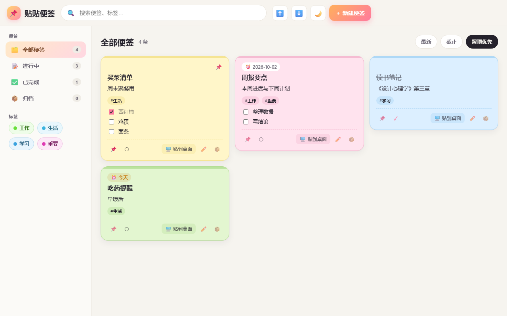
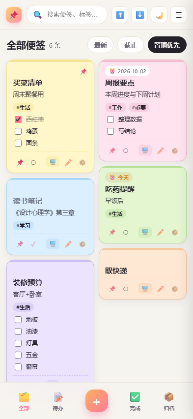

# 贴贴便签 · SnugNote

> 一款借助AI开发的便携贴放便签的软件

轻量便利贴 + 轻量任务管理。桌面可以贴成便签墙，手机可以随手记；清单能勾选、标签能筛选、
便签能贴到桌面也能收回来。

**[⬇ 下载最新版](https://snugnote.xxmy.work/)** · [主站](https://www.xxmy.work/)



<p align="left"></p>

## 能做什么

- **便签墙** —— 新建 / 编辑 / 删除 / 置顶，五种颜色
- **清单勾选** —— 便签里的待办项可直接勾；桌面贴纸上的勾选会写回同一份数据
- **标签筛选** —— 多标签 AND 筛选，同名同色
- **任务状态** —— 进行中 / 已完成 / 归档（归档充当删除缓冲区，归档页才能真删）
- **贴到桌面** —— 把便签贴成桌面贴纸：可拖动、可拉伸、可单张置顶；
  关掉的会**记住摆放**，下次按原位置回来
- **托盘清单** —— 托盘菜单列出已贴出的便签，点一下提到最前
- **开机自启动** —— 可选，默认关闭
- **离线可用** —— 网页版是 PWA，装到桌面或手机主屏后断网也能打开

## 下载

| 平台 | 说明 |
| --- | --- |
| **Windows 10 / 11** | 免管理员、免联网，只要系统自带 .NET Framework 4.x |
| **Android 7.0+** | APK；安装时需允许「未知来源」；纯本地，不联网 |

历史版本与每个文件的 SHA-256 校验值都在发布页：**<https://snugnote.xxmy.work/>**

> ⚠️ 安卓包目前是 **debug 签名**，升级必须用同一把密钥，上架商店需要另做正式签名。
> Windows 安装包**未做代码签名**，SmartScreen 可能提示「未知发布者」。

## 数据在哪

便签存在**本机文件**里（`data/notes.json`），不经过任何服务器。
Windows 版与手机版**各存各的数据、互不同步**，搬家请用界面上的**导出 / 导入 JSON**。
卸载**只删程序不删数据**，重装即恢复。

## 项目结构

```
贴贴便签.exe                 交付主程序（单文件双模式：启动器 + 桌面贴纸）
launcher/                    启动器源码（Program.cs / LauncherWindow.cs）
desktop-sticker/             桌面贴纸源码 + 自测与交互测试（16 个源文件）
demo/                        前端界面（index.html / styles.css / app.js / store.js）
                             + PWA（manifest.json / sw.js / icons/）
installer/                   安装包源码（自解压安装器 + 卸载器 + 图标生成脚本）
site/                        发布页源码（部署在 snugnote.xxmy.work）
docs/screenshots/            README 用的截图
贴贴便签.build-manifest.json 18 个源文件的摘要（判断源码是否变动的权威依据）
```

`贴贴便签.exe` 是**单文件双模式**：不带参数运行时是启动器（起本地服务并打开界面），
带 `--sticker` 运行时是桌面贴纸那一半。两者共用同一份源码、同一个进程镜像。

## 自己构建

只需要 Windows 自带的 `csc.exe`（.NET Framework 4.x）——
**不需要 .NET SDK，不需要 NuGet，不需要联网**。

```powershell
# 1) 主程序：合并编译 18 个源文件 → 贴贴便签.exe
powershell -ExecutionPolicy Bypass -File launcher\build.ps1

# 2) 安装包 → dist\贴贴便签-安装包.exe
powershell -ExecutionPolicy Bypass -File installer\build-installer.ps1

# 3) 桌面贴纸的独立开发件（调试用）→ .tools\sticker_build\Sticker.exe
powershell -ExecutionPolicy Bypass -File desktop-sticker\build.ps1
```

> **哈希不是判据**：本机 `csc` 不支持 `/deterministic`，同一份源码两次编译出的 exe 字节不同。
> 判断「源码有没有被改动」请看 `贴贴便签.build-manifest.json` 里 18 个源的摘要（漂移必须为 0），
> 而 exe 的哈希只能连同它的构建时刻一起引用。

## 文档

| 文档 | 内容 |
| --- | --- |
| [产品方案与实现过程.md](产品方案与实现过程.md) | 功能与实现过程 |
| [产品方案分析.md](产品方案分析.md) | 产品视角的分析 |
| [详细设计.md](详细设计.md) | 技术蓝图（含阶段 2/3 蓝图，与「现状」分区标注） |
| [对话总结.md](对话总结.md) | 过程与史实、时间线、现状快照 |

## 已知边界

- **桌面贴纸没有移植到手机**——手机上对应的形态是 Android 小组件，属于另一件事
- **Windows 与手机数据不互通**（这是刻意的：不做账号、不做同步、便签不上服务器）
- 安卓版是 **WebView 打包壳**（Capacitor），不是 Kotlin 原生重写；
  要连 WebView 都不用，只能整份重写
- 手机会按屏幕宽度自动决定列数（1–3 列），桌面端布局不受影响
- 本项目暂无 License 文件
